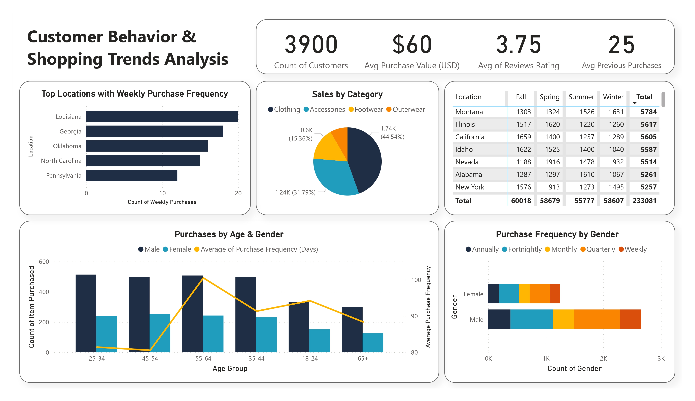

# 🛍️ Shopping Trends & Customer Behavior Analysis

This project explores the **Shopping Trends and Customer Behaviour Dataset** from Kaggle to uncover patterns in online shopping behavior, customer demographics, and purchasing trends. The project includes an end-to-end **exploratory data analysis (EDA)** in Python and an **interactive dashboard** built with Power BI.

---

## 📌 Tools Used

- **Python** (Pandas, Seaborn, Matplotlib) for data preprocessing, analysis, and visualization
- **Power BI** for designing an interactive, user-friendly dashboard

---

## 📂 Dataset

- **Source:** [Shopping Trends and Customer Behaviour Dataset](https://www.kaggle.com/datasets/sahilislam007/shopping-trends-and-customer-behaviour-dataset)
- **Size:** 3,900 rows, 18 columns  
- Contains customer profiles, purchase details, seasonal data, payment methods, discount usage, and more

---

## 📈 Key Insights

- Majority of customers are **males aged 25–54**
- **Clothing** and **accessories** are the top-selling categories
- Most purchases follow **quarterly and fortnightly cycles**
- **Montana, Illinois, and California** lead in total sales; **Louisiana and Georgia** show high weekly activity
- Only **27% of customers** use subscriptions — but there's a strong link to discount usage
- Most common payment methods are **PayPal**, **credit cards**, and **cash**

---

## ✅ Recommendations

- Expand reach to **female customers**, who are underrepresented
- Target the core demographic (males, 25–54) with personalized campaigns
- Promote **loyalty programs** to grow subscriptions
- Focus inventory and ads on top categories and locations
- Highlight popular payment options for a smoother checkout experience

---

## 📸 Dashboard Preview

---

## 📊 Outputs

- Python notebooks for data cleaning, EDA, and visualizations
- Interactive Power BI dashboard with filters for demographics, product categories, purchase frequency, and location trends

---

## 🚀 Getting Started

1. Clone this repository  
2. Run the Jupyter notebook or `.ipynb` scripts for data analysis  
3. Open the `.pbix` file in Power BI Desktop to view or edit the dashboard

---

## 🔗 Links

- 📊 [Dataset on Kaggle](https://www.kaggle.com/datasets/sahilislam007/shopping-trends-and-customer-behaviour-dataset)
  
---

## 📬 Contact

Open to feedback, suggestions, or collaboration!  
Feel free to **fork** this repo or connect with me on [LinkedIn](https://www.linkedin.com/in/reham-mahmoud-rushdi/).

---

**#DataAnalysis #Python #PowerBI #EDA #Dashboard #Kaggle**
